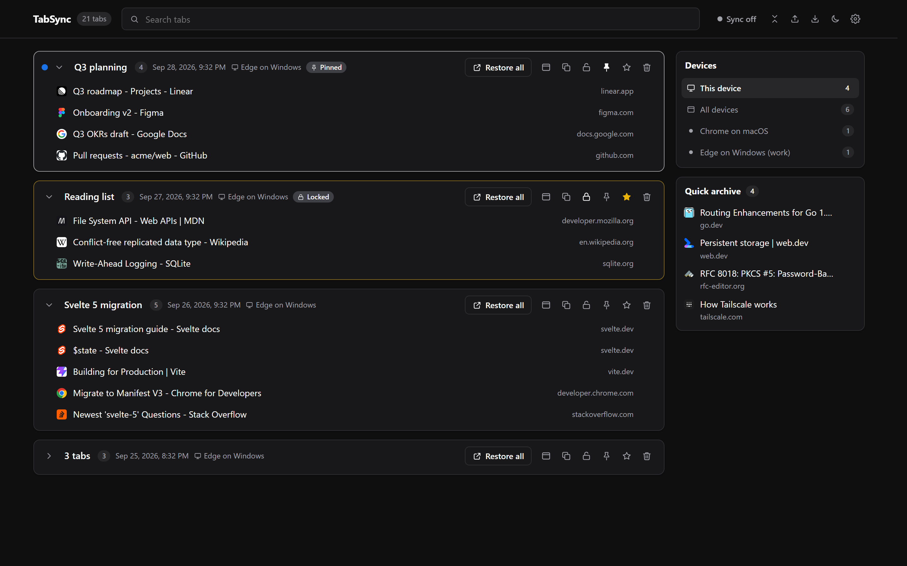
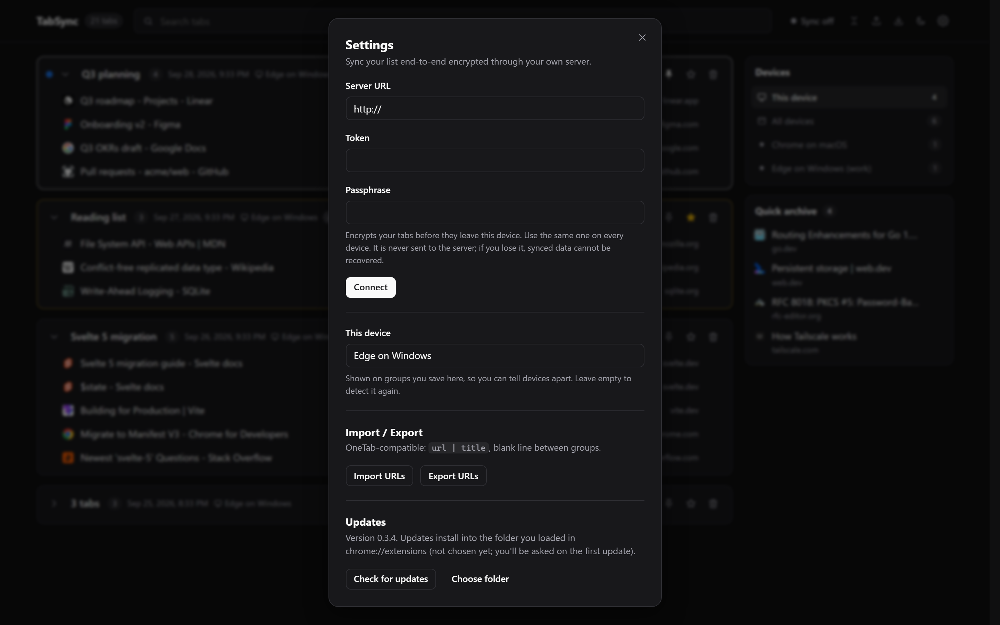

# TabSync

Collapse your open tabs into a list, and sync that list across your devices through a server you run yourself. Everything is encrypted on your device before it leaves; the server only ever sees ciphertext.

<picture>
  <source media="(prefers-color-scheme: light)" srcset="docs/list-light.png">
  
</picture>

## Why

OneTab is great until you want your tabs on a second machine. Then sync turns into a subscription at $39.99 per license, every year. Paying for software is fair; renting your own list of tabs year after year is not.

TabSync does the same job, reads and writes OneTab's export format, and syncs for free through a tiny server you host. No account, no subscription, and nobody else can read your tabs.

## Features

- **Send tabs with one click.** The toolbar icon sends the selected tabs, or the current tab group, or the whole window. Pinned tabs stay put, and duplicates are skipped.
- **Restore how you like.** Click a tab to open it in the background and remove it from the list. Hold Ctrl or Cmd to keep it, or lock a group so it is never emptied.
- **Chrome tab groups survive the round trip.** A sent tab group keeps its name and color, and restoring rebuilds it as a tab group.
- **Organize.** Rename groups inline, pin or star them, drag tabs between groups, collapse groups, and search everything.
- **Undo** any restore or delete from the toast, or with Ctrl/Cmd+Z.
- **Quick archive.** Right-click any link and choose "Send link to Quick archive". Archived links live in the sidebar and stay there after you open them.
- **Per-device view.** Every group records which browser profile saved it. The sidebar filters by this device (the default), all devices, or any single device.
- **End-to-end encrypted sync** through your own server (details below).
- **OneTab import and export** in the same `url | title` format.
- **One-click updates** from inside the extension, without the Chrome Web Store.
- **Light and dark themes**, or follow the system.



## Install the extension

1. Download `tabsync-vX.Y.Z.zip` from the latest [release](https://github.com/samsmon/tabsync/releases/latest). Use the zip under Assets, not "Source code".
2. Extract it to a folder you will keep.
3. Open `chrome://extensions`, turn on **Developer mode**, click **Load unpacked**, and choose that folder.

It works in Chrome, Edge, Brave and other Chromium browsers.

### Updating

When a new release is out, TabSync shows an **Update** banner. The first time you click it, pick the folder you loaded in `chrome://extensions` (the one with `manifest.json`); after that, updating is one click. TabSync downloads the release, writes it into that folder and restarts itself. Your saved tabs are not touched.

Chrome cannot update unpacked extensions on its own, so this uses the File System Access API on a folder you choose. It refuses any folder that does not contain TabSync.

## Run the sync server

The server is a single Go binary with SQLite, built into a small Docker image that runs as a non-root user with a 64 MB memory limit.

```bash
echo "TABSYNC_TOKEN=$(openssl rand -hex 32)" > .env
docker compose up -d --build
```

It listens on port 8080. Put it behind your reverse proxy with HTTPS, since the token travels in a request header.

Then, in the extension, open **Settings** and enter the server URL, the token, and a passphrase. Use the same passphrase on every device.

| Variable | Default | Purpose |
| --- | --- | --- |
| `TABSYNC_TOKEN` | (required) | Shared bearer token for all your devices |
| `TABSYNC_DB` | `/data/tabsync.db` | SQLite database path |
| `TABSYNC_ADDR` | `:8080` | Listen address |

## How sync works

- Every tab and every group's settings (name, pin, star, lock) is its own record, encrypted on the device with AES-256-GCM. The key is derived from your passphrase with PBKDF2 (600,000 iterations) and never leaves the device. If you lose the passphrase, synced data cannot be recovered.
- Devices push changed records and pull everything newer than their last cursor. Conflicts resolve per record, last writer wins, so edits to different tabs on different devices never overwrite each other.
- Deletes are tombstones. Deleting a group also hides tabs added to it on another device at the same time.
- Sync runs after every change, when the list opens, and every minute in the background.

## Development

```bash
cd ext
npm install
npm run dev      # rebuild into dist/ on every change; reload the extension to pick it up
npm test         # data layer tests
npm run build    # production build into dist/
```

Load `ext/dist` as an unpacked extension while developing.

Releases are cut locally with the GitHub CLI:

```bash
npm run release 0.4.0 -- --notes-file notes.md
```

The script checks the working tree, bumps the version, runs the tests, builds, zips `dist/`, commits, tags, pushes, and publishes the GitHub release that installed extensions update from.

### Layout

```
server/          Go sync server (stores ciphertext only)
ext/src/
  background.js  toolbar icon, context menus, sync and update checks
  list/          the list page
  options/       settings (also shown as a dialog on the list page)
  lib/           storage, groups, sync, crypto, updater, theme
ext/scripts/     release script
docs/            README screenshots
```
